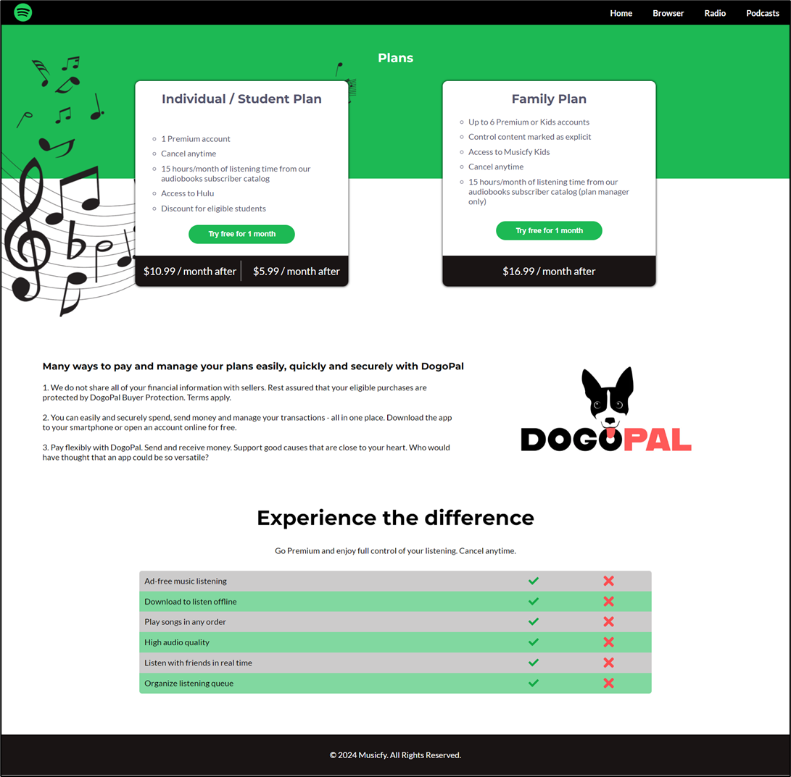

# Musicfy

## Live Demo
The project can be viewed at the following link:  
[sweet-piroshki-b6c7b4.netlify.app](https://sweet-piroshki-b6c7b4.netlify.app/)

## Description
This project is a web page created using HTML5, CSS3, and images that looks and behaves like the provided screenshot. The project uses the Google fonts 'Montserrat' for headings and 'Lato' for text. The site is designed to open correctly in the latest version of Google Chrome.

## Requirements
- Valid HTML5 and CSS3
- Use Google fonts 'Montserrat' and 'Lato'
- Proper display in the latest version of Google Chrome

## Screenshot
